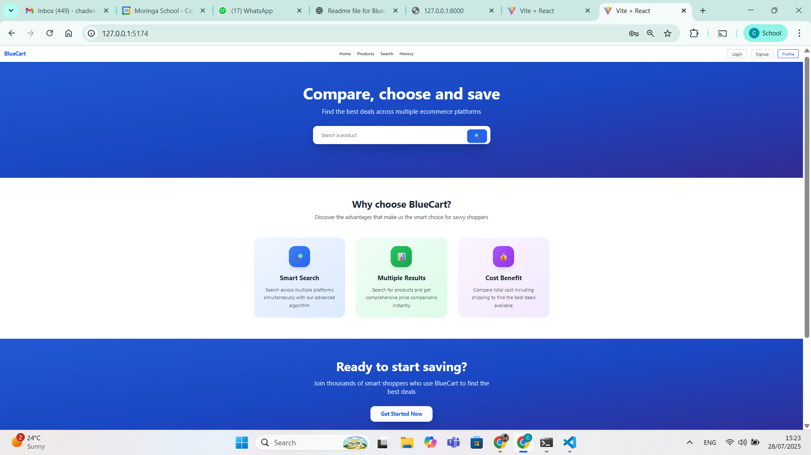

# 🛒 BlueCart Marketplace

**BlueCart Marketplace** is a full-stack web application that allows users to search, compare, and analyze product prices across multiple e-commerce platforms (Amazon, eBay, Alibaba, etc.). The app is built with **React + Redux Toolkit** on the frontend and **FastAPI** on the backend, with a **PostgreSQL** database.

---

## 🚀 Features

- 🔍 Product search across multiple marketplaces  
- ⚖️ Price comparison with dynamic cost-benefit and margin analysis  
- 🗂 Filtering and sorting based on price, vendor, rating, and more  
- 💾 User authentication (Signup, Login, Logout)  
- 📝 Search history for logged-in users  
- ⭐ Review system for products  
- 🌐 Live crawling & API integration (Amazon, Alibaba, etc.)

---

## 🧱 Tech Stack

### Frontend

- React  
- Redux Toolkit  
- React Router  
- Tailwind CSS  
- Jest (for testing)

### Backend

- FastAPI  
- PostgreSQL  
- SQLAlchemy  
- Pytest  
- Pydantic

---

## 🗄️ Project Structure

bluecart-marketplace/

├── client/ # React frontend
│ ├── src/
│ │ ├── components/
│ │ ├── pages/
│ │ └── App.jsx
│ └── tailwind.config.js
│
├── server/ # FastAPI backend
│ ├── app/
│ │ ├── models.py
│ │ ├── routes/
│ │ ├── schema.py
│ │ └── main.py
│ ├── tests/
│ └── seed.py

---

## ⚙️ Installation & Setup

### Clone the repo

git clone https://github.com/your-username/bluecart-marketplace.git
cd bluecart-marketplace
Backend Setup

cd server
python3 -m venv venv
source venv/bin/activate
pip install -r requirements.txt
uvicorn app.main:app --reload
Frontend Setup

cd ../client
npm install
npm run dev

---

🧪 Running Tests
Frontend (Jest)

cd client
npm test
Backend (Pytest)

cd server
pytest

---

🧠 Lessons Learned
Effective use of Redux for managing search & filter state

FastAPI + Pydantic made data validation seamless

Challenges in handling cross-origin APIs and scraping

Importance of modular, reusable components and API routes

📌 Future Improvements
Product alerts / notifications

Shopping cart and purchase simulation

Admin dashboard for vendor analytics

---

📄 License
This project is licensed under the MIT License.